# Twins Karaoke client for Apple Mobile Devices

A karaoke player for [twinskaraoke.com](https://neurokaraoke.com) — available for iPhone, iPad and Apple Watch

All credits go to the website creator "Soul". This is a companion app for the website with extra features.

This App Created By
- [@ytsodacan](https://github.com/ytsodacan) (SillyProotSoda) 
- [@XiaoYuan151](https://github.com/XiaoYuan151) (XiaoYuan151).  

> Warning : currently the installation process is somewhat technical and requires a Mac, we hope to change this soon so if you feel put off by these instructions or do not have a Mac please be patient while we work on other methods.

## Features

<b>screenshots</b>

 

  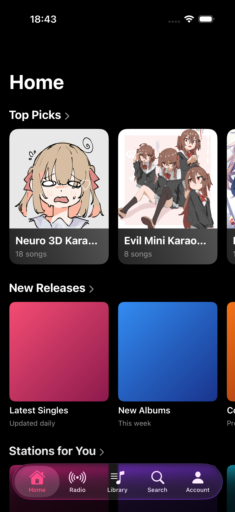
  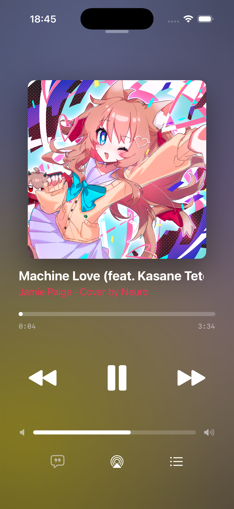
  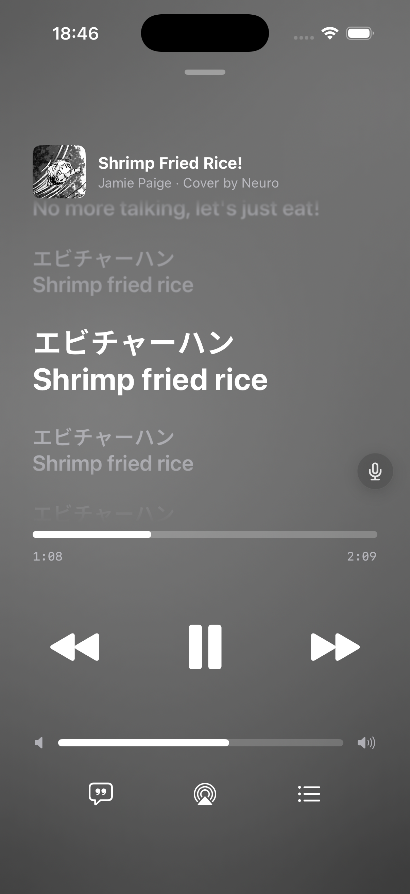

  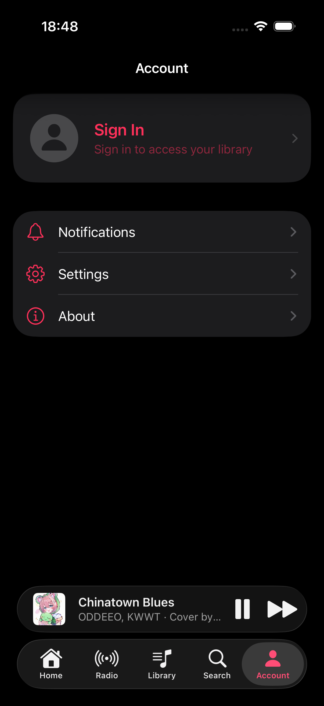
  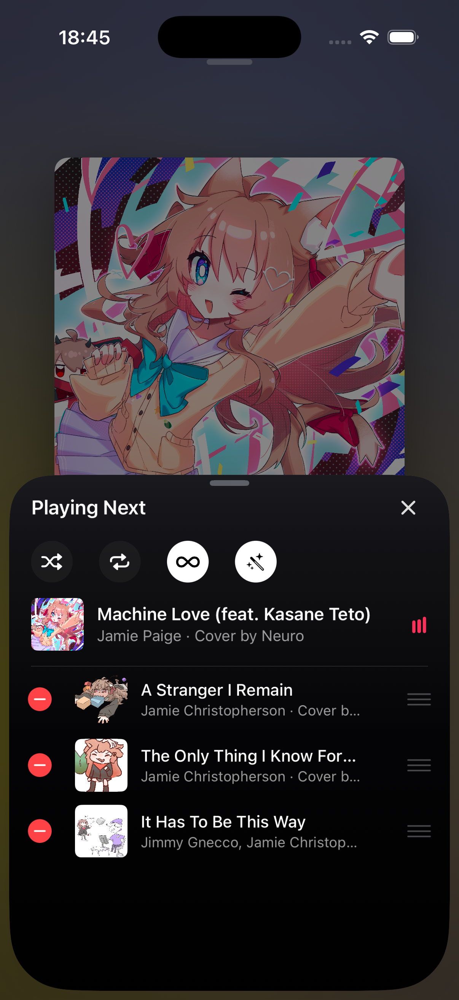
  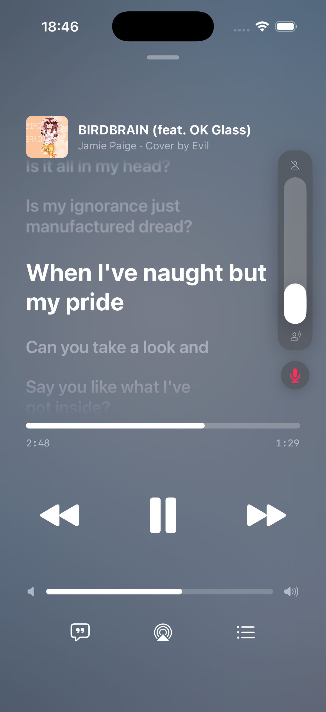

  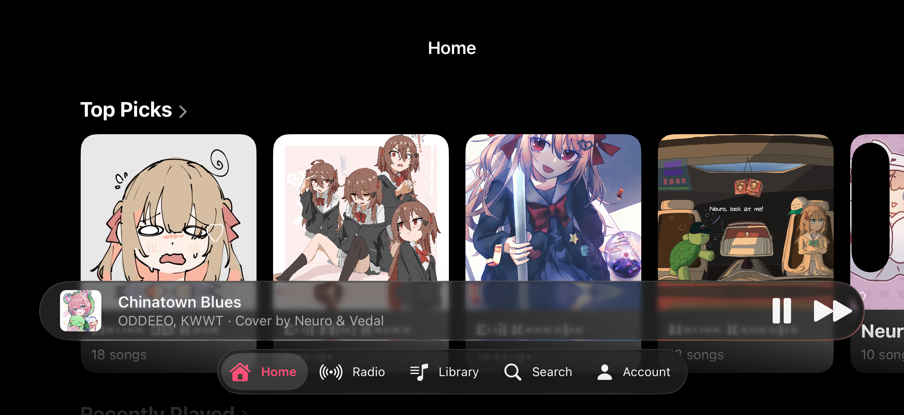
   
  <em>Full landscape support for iPad and iPhone</em>

  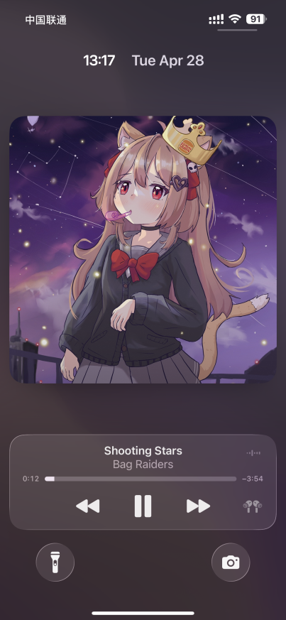
   
  <em>Full background playback and system controls</em>

# Twinskaraoke - iOS Installation Guide

Currently, Twinskaraoke is not available on the App Store, via TestFlight, or as a pre-signed `.ipa` file.

To install the app on your iPhone or iPad, you must build from source.
> if you are familiar with the "magic" that is swift dev you may skip to 6c 

## Requirements
1. **A Mac computer** (Xcode is only available on macOS, any mac will do).
2. **An Apple ID** (A standard, free account works perfectly).
3. **Your iPhone/iPad** and a USB cable to connect it to your Mac

##### Getting Help
- If you need help during installation you can ask in the neurosama discord server (neurocord) in the _"Neuro & Evil Karaoke Web Player"_ Thread but please look up the issue first

---

## Step 1: Prepare your Apple Developer Account
You **do not** need to pay for the $99/year Apple Developer program to install this app on your own device. A standard, free Apple ID will act as a free developer account for personal sideloading.

* **If you already have an Apple ID:** You can just use the same Apple ID you use on your iPhone. 
* **If you don't have an Apple ID, or want to make a separate one:**
  1. Go to[appleid.apple.com](https://appleid.apple.com/).
  2. Click **Create Your Apple ID** in the top right corner.
  3. Fill out the required information and verify your email/phone number. 

## Step 2: Download and Install Xcode
Xcode is Apple's official software for building iOS apps. It is completely free but quite large.

1. On your Mac, use **App Store** to get the **Xcode** app
2. Once installed, click **Open** to launch Xcode for the first time
3. Xcode will prompt you to "Install additional required components." Click **Install** and enter your Mac's login password if prompted. Wait for this process to finish

---

## Step 3: Download the Twinskaraoke Project 
1. Scroll to the top of this GitHub page.
2. Click the green **`<> Code`** button.
3. Click **Download ZIP**.
4. Once downloaded, find the file (usually in your Downloads folder) and double-click the `.zip` file on your Mac to extract the folder.
> you can of course clone via your preferred method

## Step 4: Add your Apple ID to Xcode
Xcode needs your Apple ID to create a free temporary signing certificate so your iPhone will accept the app.
1. Open **Xcode**.
3. In the top Mac menu bar, click **Xcode** -> **Settings...** (or Preferences).
4. Click on the **Accounts** tab at the top of the settings window.
5. Click the **`+`** button in the bottom left corner, select **Apple ID**, and click **Continue**.
6. Log in with your Apple ID and password. 
7. You should now see your name listed with a "(Personal Team)" role. Close this window.

## Step 5: Open the Project
1. Open the extracted `Twinskaraoke-main` folder.
2. Find the Xcode project file (it will be named `Twinskaraoke.xcodeproj` or `Twinskaraoke.xcworkspace`). Double-click it to open it in Xcode.
3. *If your Mac asks if you want to trust and open a project downloaded from the internet, click **Trust and Open**.*

---

## Step 6: Fix the "Team" and "Bundle Identifier" Errors
### Part A: Update the Main iOS App
1. Look at the file navigator on the far left side of Xcode. Click on the top-most blue icon named **Twinskaraoke**.
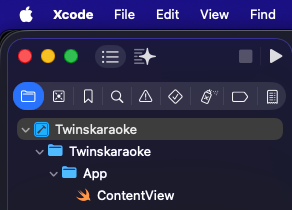
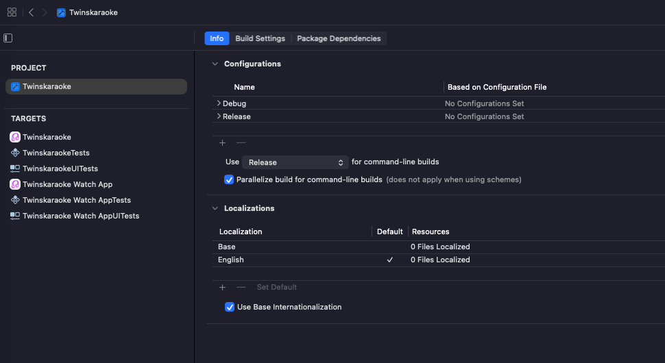
2. In the middle section of Xcode, look at the **TARGETS** list and click on **Twinskaraoke** (the first one).
3. Click on the **Signing & Capabilities** tab at the top of this middle section.
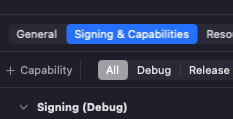
4. Check the box that says **Automatically manage signing**. (should already be checked though)
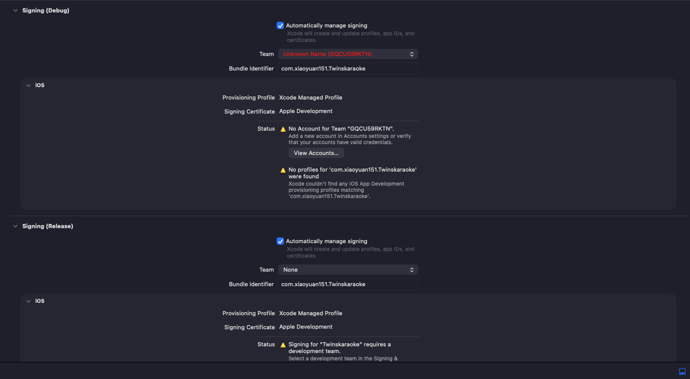
5. In the **Team** dropdown menu, change it from the red "Unknown Name" to **Your Name (Personal Team)**.
6. **Crucial Step:** You must change the **Bundle Identifier** to something globally unique. 
   * It currently says: `com.xiaoyuan151.Twinskaraoke`
   * Change `xiaoyuan151` to your own name without spaces. For example: `com.johnsmith.Twinskaraoke`
   * *Press `Enter` on your keyboard after typing it.* Xcode should spin for a second and the red errors should disappear.
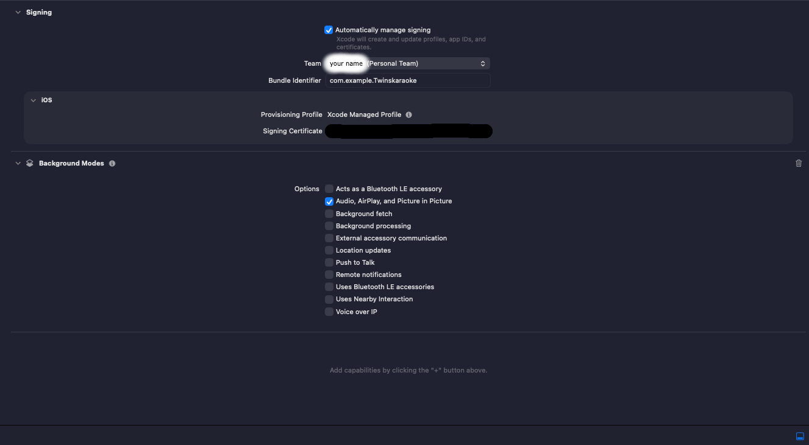
### Part B: Update the Watch App target
Because this app includes an Apple Watch component, you **must** update its identifiers to match the one you just created, otherwise the build will fail.
1. In the **TARGETS** list on the left side of the middle pane, click on **Twinskaraoke Watch App**.
2. Go to the **Signing & Capabilities** tab.
3. Change the **Team** dropdown to **Your Name (Personal Team)**.
4. Change the **Bundle Identifier** to match exactly what you typed in Part A, but keep the `.watchkitapp` at the end.
   * Example: `com.johnsmith.Twinskaraoke.watchkitapp`
   * *Press `Enter`.*

### Part C: Update the Watch App's "Info" settings
This step links the Watch App to the Phone App.
1. While still selecting the **Twinskaraoke Watch App** target, click the **Info** tab at the top (next to Resource Tags / Build Settings).
2. Look through the list of Keys for one named **`WKCompanionAppBundleIdentifier`**.
3. Under the "Value" column, double-click to edit it. 
4. Change it to the **exact Bundle Identifier of the Main App** you created in Part A.
   * Do *NOT* include `.watchkitapp` at the end of this value! 
   * **Correct Example:** `com.johnsmith.Twinskaraoke`
   * **Incorrect Example:** `com.johnsmith.Twinskaraoke.watchkitapp`
5. Press `Enter`.
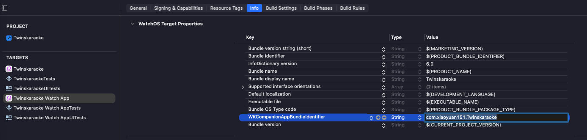

---
---

## Step 7: Prepare your iPhone
_Better Guides Than This Exist - if you get stuck here just google it_

1. Plug your iPhone into your Mac using a USB cable.
2. If a prompt appears on your iPhone, tap **Trust This Computer** and enter your passcode.
3. **If you are on iOS 16 or later, you MUST enable Developer Mode:**
   * On your iPhone, open the **Settings** app.
   * Go to **Privacy & Security**.
   * Scroll down to the very bottom and tap **Developer Mode**.
   * Toggle it **ON**. Your iPhone will ask to restart. 
   * After it restarts, unlock your phone and tap **Turn On** when the prompt appears.

## Step 8: Build and Install
1. At the very top middle of the Xcode window, you will see a device selector (it might say "Any iOS Device" or show an iPhone simulator model). Click it.
2. A drop down with a long list of possible destenations will appear at the bottom of this will be a option for "Manage Run Destinations"
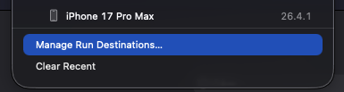 
3. On the Menu that opens, look under "iOS Devices" and select **Your actual iPhone** or **Your actual iPad**.
4. In the top left corner of Xcode, click the big **Play (▶) button** to build and run the app.
5. Xcode will begin compiling the app. This may take a few minutes. 
   * *If you get a prompt asking for permission to access your "keychain", enter your **Mac login password** and click "Always Allow" (you may need to click it a few times).*
6. Once it finishes, Xcode will say "Build Succeeded" and push the app to your phone.

## Step 9: Trust the App on your iPhone
The Twinskaraoke app icon will now be on your iPhone's home screen, but if you tap it, your phone will say "Untrusted Developer".
1. On your iPhone, open **Settings**.
2. Go to **General** -> **VPN & Device Management**
3. Under the "Developer App" section, tap on your Apple ID email address.
4. Tap **Trust "[Your Email]"** and confirm.

**You're done! You can now open Twinskaraoke and use the app.**

---

### Common Errors
* **`Invalid value of WKCompanionAppBundleIdentifier key in WatchKit 2.0 app's Info.plist`**
  If the build fails with this error, it means you accidentally pasted the Watch App's ID in **Step 6, Part C**. Go back to the `Twinskaraoke Watch App` target -> `Info` tab, find `WKCompanionAppBundleIdentifier`, and make sure the value **does not** end in `.watchkitapp`. It must be identical to your Main iOS App identifier.

### Important Note regarding Free Developer Accounts
Because you are installing this using a free, personal Apple ID, the app certificate will expire in **7 days**. 

After 7 days, the app will crash immediately when you try to open it. **You do not need to delete the app.** To fix this, simply plug your phone back into your Mac, open this Xcode project, and click the Play (▶) button again to refresh the 7-day timer. All of your saved data inside the app will remain perfectly intact.

---
## License
This project is licensed under the [Apache-2.0 License](LICENSE).

